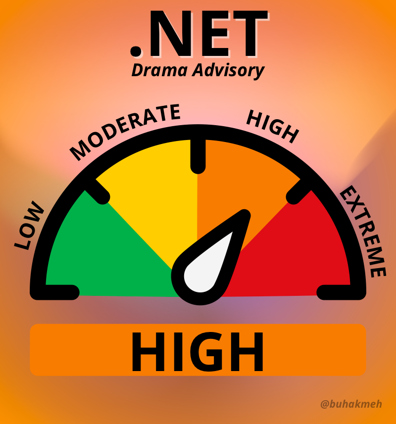

# .NET Drama Meter Service

A Minimal API that generates a .NET Drama meter based on a level:

- **Low**
- **Moderate**
- **High**
- **Extreme**

Run the project and pass a `level` url parameter. For example a level of `high` will generate the following image.

## License

Feel free to play around with the project, the assets are my copyright, so please don't steal them for your own gains. You can deploy it and use your own instance, but be sure to reach out to me and let me know on Twitter at [@buhakmeh](https://twitter.com/buhakmeh).

## Thanks

Using ImageSharp to do image manipulation.